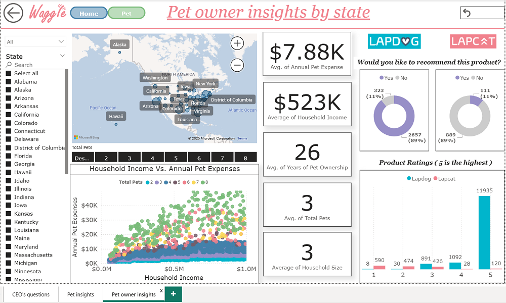

# Project 2: Power BI Report for Waggle

## Objective

Waggle, a startup specializing in smart pet devices, has seen major success with its **Lapdog** fitness collar for dogs. With the recent development of a **Lapcat** version for cats, leadership is evaluating its potential. This project involves building a boardroom-ready Power BI report that compares Lapcat performance data to the proven success of the Lapdog, helping stakeholders make informed decisions.

---
## Project Overview

The goal is to deliver a polished, interactive Power BI report that tells the story behind the data. The report addresses business questions, adheres to branding and accessibility standards, and demonstrates strong layout design and interactivity.

---
## Key Tasks

### 1. Business Insights
- Use the provided data model to explore and visualize key differences between **Lapdog** and **Lapcat** devices.
- Analyze metrics such as **average daily steps over time** and **customer reviews**.
- Answer specific business questions from the CEO using appropriate visuals.

### 2. Layout & Design
- Apply a branded theme using provided marketing materials.
- Design a layout with a clear visual hierarchy that aligns with modern design principles.
- Ensure accessibility through consistent use of colors and contrast standards.

### 3. Interactivity & Filtering
- Include at least **five slicers** using different filtering options and visual styles.
- Build interactivity that allows stakeholders to explore data dynamically.

### 4. Colors, Navigation & Bookmarks
- Implement at least **two bookmarks** to control views or highlight insights.
- Use **buttons** as navigation triggers and to activate bookmarks for enhanced user experience.

---
### Dashiboard Preview

I have created three pages for the report. 

🟠 Income & Location insights

( I could have moved all the slicers to the left for more convinience.)
   
🟣 Customer Insights

🔵 Product Insights

---
